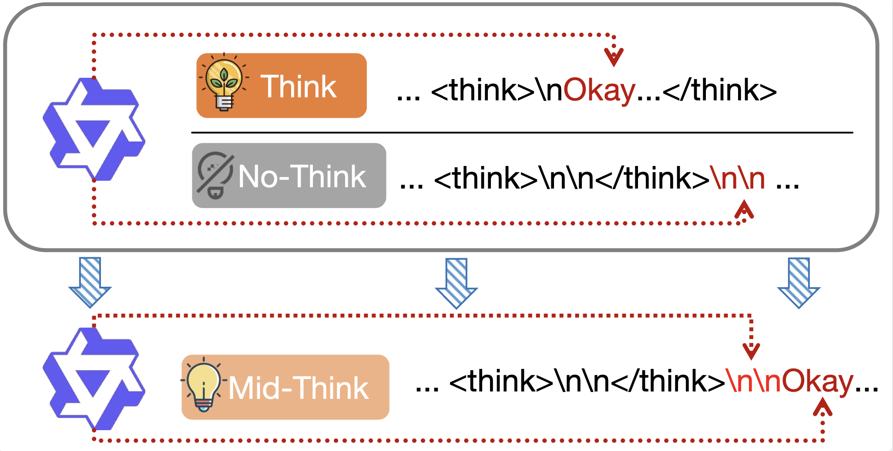

# Mid-Think

 

## Run Experiments
- run the experiments of attnetion on trigger tokens, please go to collect/collect_think_attn.py
- run the experiments of Mid-Think on different models
    - go to collect/collect_think_budget_all.py
        ```shell
        python collect/collect_think_budget_all.py \
            --model "$MODEL" \
            --dataset "$DATASET" \
            --save_path "$SAVE_PATH" \
            --max_samples $MAX_SAMPLES \
            --max_tokens $MAX_TOKENS \
            --temperature $TEMP \
            --top_p $TOPP \
            --n 5 \
            --enable_thinking True
        ```
- run the experiments of fixed-tokens methond
    - go to collect/qwen3_draw_plot_data_llm.py
        ```shell
        python collect/qwen3_draw_plot_data_llm.py \
        --model "$MODEL" \
        --dataset "$DATASET" \
        --max_samples $MAX_SAMPLES \
        --think_budget $THINK_BUDGET \
        --answer_budget $ANSWER_BUDGET \
        --n $N \
        --temperature $TEMP \
        --top_p $TOP_P \
        --save_path "$SAVE_PATH" \
        ```

## Result show
- for the results of oveview, please go to results/collect_think_budget_overview.ipynb
- for the results of motivation, please go to results/collect_think_budget_motivation.ipynb
- for the results of budget control verification, please go to results/collect_think_budget_control.ipynb
- for the results of Mid-think on different models, please go to:
    - results/collect_think_budget_hybrid.ipynb
    - results/collect_think_budget_pure.ipynb
    - results/collect_think_budget_rl.ipynb
- for the results of applying Mid-think on RL, please go to results/collect_think_budget_train.ipynb 